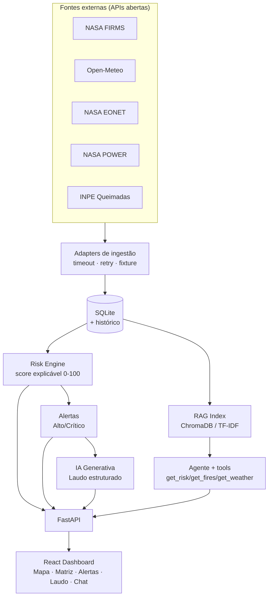

# 🛰️ OrbitGuard AI

> POC da **Global Solution 2026.1 — FIAP**: plataforma inteligente de apoio à prevenção de desastres climáticos que transforma dados orbitais e climáticos abertos em **monitoramento, análise de risco explicável, laudos por IA Generativa e consulta via agente RAG** — tudo em um dashboard geoespacial "mission control".

---

## 👥 Integrantes

| Nome completo | RM |
|---|---|
| [INTEGRANTE 1] | [RMxxxxx] |
| [INTEGRANTE 2] | [RMxxxxx] |
| [INTEGRANTE 3] | [RMxxxxx] |

> _Substitua pelos nomes e RMs reais antes da entrega._
> Concorrer ao pódio? Incluir a frase **"QUERO CONCORRER"** na capa do PDF e no vídeo.

---

## 1. Problema

Dados orbitais (focos de fogo, clima, eventos naturais) existem em abundância e são públicos, mas estão **espalhados, crus e em formatos técnicos**. Equipes de prevenção precisam transformar isso em **decisão rápida**: onde está o risco, por quê, e o que fazer.

## 2. Solução

O **OrbitGuard AI** coleta dados reais de múltiplas fontes (NASA FIRMS, Open-Meteo, NASA EONET, NASA POWER, INPE), calcula um **score de risco explicável (0–100)** por região, gera **alertas** e **laudos técnicos por IA Generativa**, e permite **perguntar a um agente RAG** que responde com **fontes citadas** — combinando base de conhecimento espacial com dados vivos do sistema. Foco operacional do MVP: **risco de queimadas no Brasil**.

> ⚠️ **POC acadêmica de apoio à decisão. NÃO é um sistema oficial de emergência nem substitui órgãos como Defesa Civil, INPE ou Corpo de Bombeiros.**

## 3. Temas da GS atendidos

| Tema | Como o OrbitGuard atende |
|---|---|
| IA Generativa para análise de dados orbitais | LLM gera laudo estruturado a partir de focos, clima, tendência e fontes |
| Plataformas de monitoramento e prevenção de desastres | Motor de risco classifica regiões em Baixo/Moderado/Alto/Crítico |
| RAG e agentes com bases espaciais | ChromaDB + agente consultam base NASA/INPE/ESA + dados vivos |
| Dashboards de dados espaciais | React + Leaflet + matriz de risco + alertas + chat |
| Automação, scraping e integração de APIs | Conectores com timeout/retry/cache/fixture para FIRMS, EONET, Open-Meteo, POWER, INPE |

---

## 4. Arquitetura



Princípio técnico: **cada fonte externa tem adapter próprio com timeout, retry, tratamento de erro e fixture de demo** — a apresentação funciona mesmo sem internet ou se uma API cair.

---

## 5. Tecnologias

**Backend:** Python 3.11+ · FastAPI · SQLModel/SQLite · httpx · tenacity · OpenAI SDK (OpenRouter) · ChromaDB · pytest
**Frontend:** React 18 · Vite · TypeScript · TailwindCSS · Leaflet/react-leaflet · Recharts · axios
**IA:** OpenRouter (laudos + agente, com fallback de modelos) · RAG com embeddings locais (ChromaDB onnx, all-MiniLM-L6-v2) e **fallback TF-IDF puro-Python**

---

## 6. Fontes de dados

| Fonte | Uso | Link |
|---|---|---|
| NASA FIRMS | Focos ativos de fogo (MODIS/VIIRS) | https://firms.modaps.eosdis.nasa.gov/api/area/csv |
| Open-Meteo | Clima atual por lat/lon (sem chave) | https://open-meteo.com/en/docs |
| NASA EONET v3 | Eventos naturais (wildfires/storms/floods) | https://eonet.gsfc.nasa.gov/docs/v3 |
| NASA POWER | Meteorologia diária histórica | https://power.larc.nasa.gov/docs/services/api/temporal/daily/ |
| INPE Queimadas | Validação BR (cruzamento FIRMS×INPE) | https://data.inpe.br/queimadas/dados-abertos/ |

---

## 7. Como rodar do zero

Pré-requisitos: **Python 3.11+** e **Node 18+**.

### 7.1 Backend (FastAPI)

```powershell
cd src/backend
python -m venv .venv
.\.venv\Scripts\python.exe -m pip install -r requirements.txt
# (opcional, RAG semântico) .\.venv\Scripts\python.exe -m pip install -r requirements-optional.txt
copy .env.example .env          # Linux/macOS: cp .env.example .env
.\.venv\Scripts\python.exe -m uvicorn app.main:app --reload --port 8000
# API em http://localhost:8000  ·  docs em http://localhost:8000/docs
```

### 7.2 Frontend (React + Vite)

```powershell
cd src/frontend
npm install
npm run dev
# Dashboard em http://localhost:5173
```

> Se a porta 8000 estiver ocupada, suba o backend em outra porta
> (`--port 8077`) e crie `src/frontend/.env` com `VITE_API_URL=http://localhost:8077`.

### 7.3 Atalho (Windows)

```powershell
./run-dev.ps1      # sobe backend + frontend juntos
```

---

## 8. Configuração (`.env`)

Tudo é **opcional** — o app roda 100% offline com fixtures sem nenhuma chave.

| Variável | Para quê |
|---|---|
| `FIRMS_MAP_KEY` | Focos reais da NASA FIRMS (chave grátis) |
| `OPENROUTER_API_KEY` | Laudos e chat com LLM real (senão usa fallback determinístico) |
| `LLM_REPORT_MODELS` / `LLM_AGENT_MODELS` | Listas de fallback de modelos |
| `EMBEDDINGS_PROVIDER` | `local` (ChromaDB) ou `none` (TF-IDF) |

---

## 9. Demo offline (sem internet / sem chaves)

```powershell
# Popula tudo com fixtures, calcula risco e gera alertas:
curl -X POST "http://localhost:8000/ingest/run?use_fixture=true&sources=firms,weather,eonet,inpe"
curl -X POST "http://localhost:8000/risk/recalculate"
```

O dashboard já faz isso automaticamente no primeiro carregamento quando o banco está vazio.

---

## 10. Testes

```powershell
cd src/backend
.\.venv\Scripts\python.exe -m pytest -q     # 20 testes
```

Cobrem: `/health`, parsers FIRMS/Open-Meteo, ingestão por fixture, score baixo/crítico, dedup de alertas, RAG (retrieval + chat com tools).

---

## 11. Endpoints principais

`GET /health` · `POST /ingest/run` · `GET /ingest/runs` · `GET /regions` · `GET /fires` · `GET /weather` · `GET /events` · `POST /risk/recalculate` · `GET /risk` · `GET /alerts` · `PATCH /alerts/{id}/status` · `POST /report/{region_id}` · `POST /chat` · `POST /rag/reindex`

Documentação interativa: `http://localhost:8000/docs`.

---

## 12. Estrutura

```
OrbitGuard/
├─ README.md
├─ run-dev.ps1
├─ document/            # PDF de entrega + diagramas
├─ assets/              # prints do dashboard
├─ Plano/               # planejamento (visão geral + 3 etapas)
└─ src/
   ├─ backend/          # FastAPI (core, db, models, ingestion, risk, llm, rag, api)
   └─ frontend/         # React + Vite + Tailwind (mission control)
```

---

## 13. Links da entrega

- **Repositório:** [link do repositório]
- **Vídeo (YouTube, não listado):** [link do vídeo]
- **PDF da entrega:** `document/entrega.pdf`

---

_OrbitGuard AI — Global Solution 2026.1 · FIAP. POC acadêmica de apoio à decisão._
