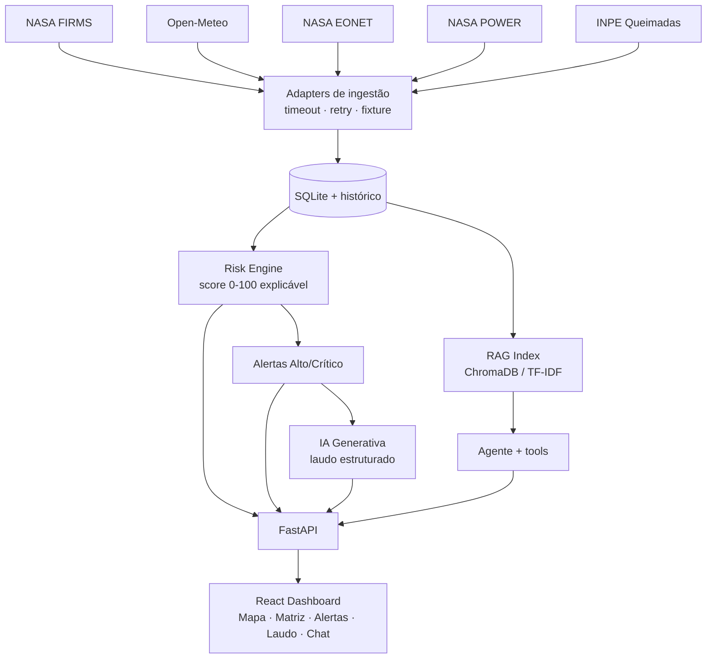

# Diagrama de Arquitetura — OrbitGuard AI

## Visão geral (Mermaid)



## Fluxo de ingestão até alerta (ASCII)

```
[APIs externas] --(httpx timeout/retry)--> [Adapter] --falha?--> [Fixture local]
        |                                       |
        +------------------> [IngestRun status] |
                                                v
                                        [SQLite: FireFocus / WeatherReading / NaturalEvent]
                                                v
                              [features.py] -> [engine.py: score 0-100 -> nível]
                                                v
                                 [RiskAssessment] --Alto/Crítico--> [Alert (dedup)]
                                                v
                            [reports.py: laudo IA/regras]   [agent.py: chat RAG + tools]
                                                v
                                          [FastAPI] -> [Dashboard React]
```

## Motor de risco

```
fire_activity  = 0,60·focos_24h + 0,10·densidade + 0,15·brilho + 0,15·confiança
weather_stress = 0,40·temperatura + 0,40·(baixa_umidade) + 0,20·(pouca_chuva)
spread         = vento
trend          = focos_24h / focos_7d

score = 0,40·fire_activity + 0,30·weather_stress + 0,15·spread + 0,15·trend
níveis: 0-24 Baixo · 25-49 Moderado · 50-74 Alto · 75-100 Crítico
```
